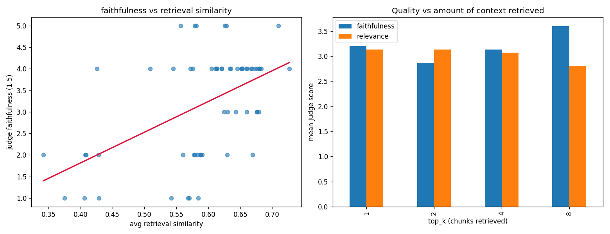

# RAG Eval Judge

A self-contained project that builds a small **RAG (retrieval-augmented
generation)** system, scores its answers with a **local LLM-as-judge**, and runs
**regression analysis** to find which retrieval features predict answer quality.

No API keys required — everything runs locally:
- **Data:** Wikipedia public API (`wikipedia` package)
- **Embeddings:** `sentence-transformers` (local)
- **Generation + Judge:** [Ollama](https://ollama.com) running `llama3.2:3b` (local)

## Pipeline

```
Wikipedia API ──▶ chunk + embed ──▶ retrieve top-k ──▶ LLM answer
                                                            │
                                                            ▼
                          regression + graphs ◀── LLM-as-judge scores
                                                  (faithfulness, relevance)
```

## The research question

> Do retrieval features (similarity score, amount of context, top-k) predict
> the LLM-judge's quality scores?

We run every question at several `top_k` settings to create variance, log
features + judge scores to a CSV, then fit an OLS regression and plot it.

## Results

Across 60 runs (15 questions × `top_k` ∈ {1, 2, 4, 8}), scored by a local
`llama3.2:3b` judge:



**Finding:** the *peak* retrieval similarity (`max_similarity`) is a
statistically significant predictor of judge **faithfulness**
(coefficient ≈ +14.7, p ≈ 0.007), while raw context size and `top_k` are not —
and the two are collinear (more `top_k` simply means more context). In other
words, *how relevant your single best retrieved chunk is* matters more for
answer faithfulness than *how much* context you stuff into the prompt.

> Numbers will vary by run since local LLM generation is non-deterministic;
> re-run `make experiment` to reproduce.

## Setup

```bash
# 1. Install + start Ollama, pull the model
brew install ollama
ollama serve &
ollama pull llama3.2:3b   # memory-friendly on Apple Silicon (8B llama3 OOMs on base M-series)

# 2. Python deps
python3 -m venv .venv && source .venv/bin/activate
pip install -r requirements.txt
```

## Run

Common tasks are wrapped in a `Makefile` (run `make help` to list them):

```bash
make setup        # create venv + install deps
make fetch        # download + cache the Wikipedia corpus
make test         # run the unit tests
make experiment   # RAG + judge over all questions -> outputs/results.csv
make analyze      # OLS regression + outputs/analysis.png
make serve        # run the API locally (needs Ollama running)
```

## Project structure

```
rag_eval/        Core library (importable package)
  corpus.py        Fetch/cache the Wikipedia knowledge base
  rag.py           Chunk, embed, retrieve, generate (the RAG system)
  judge.py         LLM-as-judge scoring (faithfulness, relevance)
  questions.py     Evaluation questions
evaluation/      Experiment + analysis (the offline eval harness)
  run_experiment.py  Orchestrates the eval, writes results CSV
  analyze.py         Regression + visualization
app/             Deployable FastAPI service (/health, /query, /evaluate)
tests/           Unit tests (mocked Ollama, no network)
Dockerfile, docker-compose.yml, Makefile
```

## API

```bash
make serve                       # or: uvicorn app.main:app --reload
curl localhost:8000/health
curl -X POST localhost:8000/query \
  -H 'Content-Type: application/json' \
  -d '{"question": "What is a black hole?", "top_k": 4}'
```

`/evaluate` returns the same answer plus the LLM-as-judge faithfulness/relevance scores.

## Deployment (Docker)

The stack runs as two containers — the API and Ollama — via Docker Compose:

```bash
docker compose up -d                              # build + start API + Ollama
docker compose exec ollama ollama pull llama3.2:3b  # one-time model pull
curl localhost:8000/health
```

(Equivalently: `make up && make pull-model`.) The API container talks to Ollama
over the Docker network via `OLLAMA_HOST=http://ollama:11434`; Ollama's models
persist in a named volume so they survive restarts.

### Deploying to a cloud (AWS)

This containerizes cleanly, but **LLM inference is memory-heavy**, so be
deliberate about where Ollama runs:

| Option | Notes |
|--------|-------|
| **ECS / Fargate** | Run the API on Fargate; point `OLLAMA_HOST` at a hosted LLM endpoint or a dedicated Ollama EC2 instance. Fargate has no GPU, so a 3B model on CPU is slow. |
| **EC2 (single box)** | Simplest: one instance running `docker compose up`. A `t3.large`/`t3.xlarge` handles a 3B model on CPU; a `g4dn` GPU instance is far faster but costs more. |
| **App Runner / Lightsail** | Easy to host the *API*, but still needs an LLM backend somewhere. |
| **Swap Ollama for a hosted API** | For a cheap always-on demo, replace the local Ollama calls with a hosted model API (Bedrock, Groq, etc.). The API container then needs almost no memory. |

A pragmatic portfolio setup: deploy the **API to Fargate** and have it call a
**hosted model** instead of self-hosting the LLM — cheap, always-on, and still
demonstrates the full Docker + cloud workflow.

## Extending

- Swap `JUDGE_MODEL` in `rag_eval/judge.py` to a different/stronger model than
  the generator to reduce self-bias.
- Add features (answer length, question type) to `FEATURES` in
  `evaluation/analyze.py`.
- Add ground-truth answers to compute correctness vs. the judge's scores.
